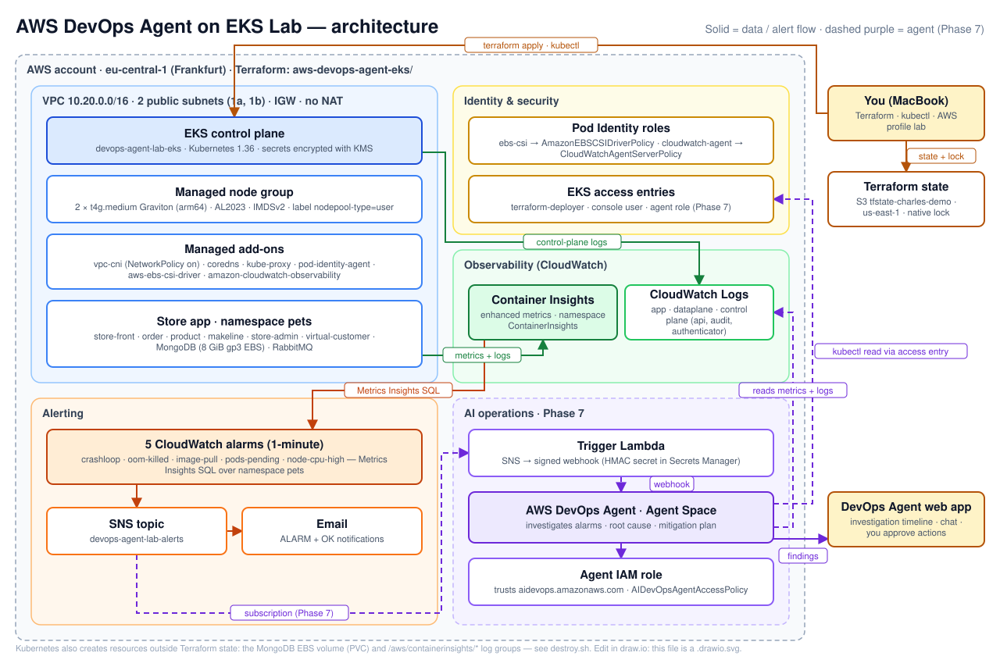

# AWS DevOps Agent on EKS — Terraform lab

The AWS counterpart of my [Azure SRE Agent lab](https://github.com/charlessalameh/Azure-sre-agent-sandbox):
same idea, same app, same break scenarios — built with **Terraform** instead of Bicep, so the two AI agents
can be compared side by side.

## Target architecture

🧠 **How it works & the agent explained:** [docs/HOW-IT-WORKS.md](docs/HOW-IT-WORKS.md) · 📘 **Step-by-step guide:** [docs/LAB-GUIDE.md](docs/LAB-GUIDE.md) · 📝 **Journal:** [docs/LAB-JOURNAL.md](docs/LAB-JOURNAL.md)

- **Region:** eu-central-1 (Frankfurt) — one of the 6 AWS DevOps Agent regions
- **Network:** reuses `../modules/networking/vpc-basic` (public subnets only, **no NAT gateway** → saves ~$32/month)
- **Compute:** EKS + managed node group, 2 × t4g.medium (Graviton)
- **App:** the same AKS Store Demo (namespace `pets`) and break scenarios as the Azure lab
- **Observability:** CloudWatch Container Insights (EKS add-on, enhanced), 5 CloudWatch alarms, SNS
- **AI:** AWS DevOps Agent — Agent Space (`awscc` provider), IAM roles, AWS account association, EKS read access
- **Trigger:** CloudWatch alarm → SNS → Lambda → DevOps Agent webhook → investigation

## Plan

| Phase | What | Status |
| --- | --- | --- |
| 0 | Clone repo, create this folder | ✅ |
| 1 | Repo housekeeping: commit email, tighten GitHub OIDC role, close SSH | ⬜ |
| 2 | Mac prerequisites, AWS login, budget alert | ✅ |
| 3 | Providers, remote state, VPC | ✅ |
| 4 | EKS 1.36, Graviton node group, add-ons with Pod Identity, access entries | ✅ |
| 5 | Store app + break scenarios | ✅ |
| 6 | Container Insights alarms (Metrics Insights SQL), SNS email | ✅ |
| 7 | DevOps Agent: Agent Space, roles, association, EKS access, webhook + trigger Lambda | ✅ |
| 8 | Break it, let the agent investigate, compare with Azure — root cause in 2 min 10 s | ✅ |
| 9 | Destroy, journal, write-up | ⬜ |

## Cost (approximate, Frankfurt)

EKS control plane ~$0.10/h + 2 × t4g.medium ~$0.08/h + small EBS/CloudWatch → **~$0.20/h (~$5/day)**.
DevOps Agent bills per second of investigation time (~$29.88 per agent-hour per the AWS sample).
**Push-button:** build, break and destroy from GitHub Actions (`aws-lab.yml`, see the guide's CI/CD section). **Destroy after every session** with `./destroy.sh` — EKS has no "stop" like `az aks stop`.
