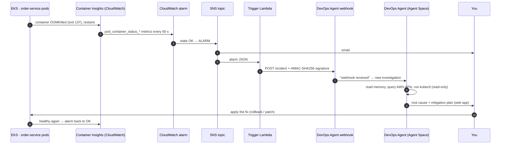

# How it works — AWS DevOps Agent on EKS

What this lab is for, how an incident flows from a broken pod to a root cause, what the agent is made of
(tools, memory, sub-agents, skills), and how to extend it to other AWS services.

> Companion docs: [LAB-GUIDE.md](LAB-GUIDE.md) (step by step) · [LAB-JOURNAL.md](LAB-JOURNAL.md) (what happened) ·
> [architecture diagram](diagrams/architecture.drawio.svg)

---

## 1. The target — why build this

| Goal | How the lab answers it |
|---|---|
| **Can an AI agent do first-line incident response on Kubernetes?** | A real outage (OOMKilled pods) is detected, investigated and explained with no human in the loop until the fix |
| **Is it real automation or a chatbot?** | Nobody opens a chat: alarm → webhook → investigation starts by itself |
| **How do the two clouds compare?** | Same app, same break scenarios as the [Azure SRE Agent lab](https://github.com/charlessalameh/Azure-sre-agent-sandbox) |
| **Can it be built as code, cheaply, and torn down?** | Terraform end to end, ≈ $0.22/h while running, `./destroy.sh` afterwards |

**Result of the first run:** root cause stated **2 min 10 s** after the investigation started, with a correct
mechanism (16Mi limit vs. a 64MB Node.js heap), the right rollback target (revision 3) and a reversible fix.

---

## 2. The incident flow, end to end



| # | Component | Built with | Notes |


|---|---|---|---|
| 1 | Pods break | `k8s/scenarios/*.yaml` | 10 scenarios: OOM, crash loop, image pull, pending, probes, network policy… |
| 2 | Metrics | `amazon-cloudwatch-observability` add-on | Enhanced Container Insights; agent + Fluent Bit run on every node |
| 3 | Alarm | `alarms.tf` | Metrics Insights SQL summing over all pods of namespace `pets`, 1-minute period |
| 4 | Fan-out | SNS | Same topic feeds your email and the Lambda |
| 5 | Trigger | `lambda/devops_agent_trigger` | Ignores OK messages; does **not** tell the agent what is wrong — only forwards the alarm |
| 6 | Webhook | Created in the console (HMAC) | Secret shown once → stored in Secrets Manager, never in Terraform/git |
| 7 | Investigation | Agent Space | Runs under `devops-agent-lab-AgentSpaceRole` |
| 8 | Kubernetes access | EKS access entry | `AmazonAIOpsAssistantPolicy` = **read-only**: the agent can look, not change |
| 9 | Fix | You | The agent proposes; a human applies (same principle as Azure "Review mode") |

---

## 3. Inside the agent

The AWS DevOps Agent is a managed, multi-agent system. You don't host a model or write prompts — you give it
**access** (IAM + EKS), **context** (memory, skills, AGENTS.md) and **triggers** (webhook, schedule, chat).

### 3.1 Agent Space — the boundary

Everything lives in one **Agent Space** (`devops-agent-lab`): which accounts it may see (our AWS association,
`monitor` mode, all regions of this account), which integrations it has (here: only the webhook), its memory,
skills and the operator web app. One space per team/application is the usual pattern.

### 3.2 Identity — two roles, least privilege

| Role | Trusted by | Policy | Used for |
|---|---|---|---|
| `devops-agent-lab-AgentSpaceRole` | `aidevops.amazonaws.com`, this account's agent spaces only | `AIDevOpsAgentAccessPolicy` (AWS managed, read-oriented) + create Resource Explorer SLR | Reading CloudWatch, EKS, EC2, logs… during investigations |
| `devops-agent-lab-OperatorRole` | same | `AIDevOpsOperatorAppAccessPolicy` | The web app you use to watch investigations |
| EKS access entry for the AgentSpaceRole | EKS API | `AmazonAIOpsAssistantPolicy` (cluster scope) | `kubectl get/describe/logs`, rollout history — no writes |

### 3.3 Built-in tools — what it can *do*

Seen in our investigation timeline:

| Tool | What it did in our run |
|---|---|
| `datetime` | Anchored "now" before reasoning about timestamps |
| `use_aws` | Confirmed the alarm, account and region via AWS APIs |
| `use_kubectl` | Listed pods/events, described the crashing pods, compared ReplicaSet revisions |
| Memory read | Read `/aidevops/memory/understanding-agent-space/overview.md` |
| `use_pipeline` | Exists (CI/CD); unused here because no pipeline is connected — which is why it couldn't name *who* made the change |

More tools appear when you connect integrations: GitHub/GitLab/Azure DevOps (code + deployments), Datadog, Dynatrace,
Grafana, New Relic, Splunk (telemetry), Slack/ServiceNow/PagerDuty (communication, tickets) and **your own MCP servers**.

### 3.4 Memory — what it *knows* about you

The agent keeps **memory stores** per Agent Space. On first setup it builds an **"understanding the agent space"**
store and a **topology** of your resources (the "Learning your topology" spinner, via AWS Resource Explorer).
That is how it knew within 30 s that this is a "Pet Store microservices on EKS" app. Memory grows with use:
past root causes and standing directives make later investigations faster.

### 3.5 Sub-agents — who does the work

The platform splits work across agent types. In our run you can see the hand-off at +2m23s
(`propose-mitigation`):

| Agent type | Role | In our run |
|---|---|---|
| Incident **Triage** | Is this real? Duplicate? Skip it? | Accepted the webhook incident |
| Incident **RCA** | Find the root cause | Steps +13s → +2m23s |
| Incident **Mitigation** | Safe, reversible fix with pre/post checks and rollback | `propose-mitigation`, delivered at +3m57s |
| **On-demand / Chat** | Questions you ask in the web app | — |
| **Evaluation / Prevention** | Proactive recommendations over time | — |
| **Release testing / readiness** | Pre-release checks | — |

### 3.6 All the building blocks at a glance

| Component | Where you see it | What it is | In this lab |
|---|---|---|---|
| **Agent Space** | Console → Agent Spaces | The tenant boundary: scope, identity, knowledge, integrations | `devops-agent-lab` (Terraform) |
| **Cloud associations** | Agent Space → AWS / Azure accounts | Which accounts/subscriptions it may read (`monitor`), or deploy from (`source`) | This AWS account, monitor |
| **Capability providers** | Console → Capability Providers | Account-level registration of external tools before a space can use them: GitHub, GitLab, Azure DevOps (pipeline) · Datadog, Dynatrace, Grafana, New Relic, Splunk (telemetry) · Slack, ServiceNow, PagerDuty (communication) · MCP servers · remote agents | None — not needed for this incident |
| **Capabilities (per space)** | Agent Space → Capabilities | What this space has switched on: webhook, integrations, private connections | Generic webhook (HMAC) |
| **Private connections** | Capability Providers → Private connections | Reach tools inside a VPC without public exposure | Not used |
| **Topology** | Agent Space → topology view | Map of resources and relationships, discovered via Resource Explorer | EKS, nodes, volumes, alarms, Lambda… |
| **Memory stores** | Web app → Knowledge | What it has learned about your environment, past root causes, directives | `understanding-agent-space` |
| **Skills / AGENTS.md / attachments** | Web app → Knowledge | Your procedures, standing rules and reference files (section 4) | None yet |
| **Triggers** | Webhook, integrations, schedules | How work starts without a human | CloudWatch → SNS → Lambda → webhook |
| **Agent types** | Investigation timeline | Triage, RCA, Mitigation, On-demand, Evaluation, Release | Triage → RCA → Mitigation |
| **Custom agents** | Web app | Your own agent: system prompt + chosen tools + skills + memory, on demand or on a schedule | Not used (idea: daily cluster health report) |
| **Operator web app** | Agent Space → Operator access | Where humans watch investigations, chat, and read the mitigation plan | Enabled via `OperatorRole` |

---

## 4. Skills — does it come with skills?

**Short answer:** the agent's *built-in* knowledge (Kubernetes, AWS services, CloudWatch, common failure modes) is
part of the managed service — you don't install anything for an OOM on EKS, which is why our run worked out of the
box. **Skills** are an *additional*, customer-managed layer: your Agent Space starts with **none**, and you add them.

### 4.1 What a skill is

A folder that follows the open [Agent Skills specification](https://agentskills.io/specification):

```
pets-store-incident-playbook/
├── SKILL.md          # required: frontmatter + step-by-step instructions
├── references/       # optional: extra docs, metric tables, dependency maps
└── assets/           # optional: diagrams, data files
```

```markdown
---
name: pets-store-incident-playbook            # lowercase-hyphen, ≤ 64 chars
description: Use this skill when investigating incidents in the pets namespace of
  the devops-agent-lab-eks cluster: order-service, makeline-service, product-service,
  store-front, MongoDB or RabbitMQ failures, CrashLoopBackOff, OOMKilled, image pull
  errors or pending pods.                     # ≤ 1,024 chars — the agent reads this to decide relevance
---
```

The agent reads every skill's **description** and loads the full instructions only when the task matches
(progressive disclosure), so many skills don't bloat every investigation.

### 4.2 Where skills live and how to add them

Skills are **assets of the Agent Space** (asset type `skill`, max 200 per space, 6 MB per skill):

| Method | Where |
|---|---|
| Web app | Agent Space web app → **Knowledge → Skills → Add skill** → Create / Upload zip / Import from GitHub |
| CLI | `aws devops-agent create-asset --asset-type skill …` |
| IaC | CloudFormation `AWS::DevOpsAgent::Asset`, Terraform `awscc_devopsagent_asset` |

Each skill can target agent types (Generic, On-demand, Incident Triage, Incident RCA, Incident Mitigation,
Evaluation, Release testing) so the right sub-agent picks it up.

Two related asset types:
- **`agents_md`** — standing instructions loaded at the **start of every task** for one agent type
  (max one per agent type, 25 KB). Use it for rules, not procedures.
- **`attachment`** — files the agent can consult: architecture diagrams, runbook PDFs, sample logs (10 GB per space).

### 4.3 Ready-made skills from AWS

AWS publishes open-source skills at [aws-samples/sample-code-for-devops-agent-skills](https://github.com/aws-samples/sample-code-for-devops-agent-skills)
([catalog](https://aws.github.io/tools-for-devops-agent/skills/)). Relevant examples:

| Skill | Service |
|---|---|
| AWS EKS Operations Review · EKS Upgrade Readiness | EKS |
| ECS Operation Review | ECS |
| Database RDS DevOps · RDS Operation Review · Database Migration Service Expertise | RDS / DMS |
| AWS VPC DNS Investigation · AWS Routing | Networking |
| Storage S3 Resiliency Expertise · Storage FSx Windows SLA Optimizer | Storage |
| MSK Operations · Redshift Support Specialist · Analytics OpenSearch Expertise | Data |
| Bedrock Operation Review · Bedrock Adoption Readiness | GenAI |
| AWS Health Events · Service Quota Check · AWS Backup Coverage Review | Platform |
| **Investigation Cost Guardrail** · **Skip Scheduled Maintenance** | Cost / noise control |

Each documents the extra IAM permissions it needs; most are already in `AIDevOpsAgentAccessPolicy`.

---

## 5. Using it for other AWS services

**No new agent is needed.** The account association already covers *all* services in *all* regions of the account,
and `use_aws` can query any of them within the role's permissions. To cover a new service you add:

1. **A signal** — a CloudWatch alarm (or EventBridge rule) on that service, published to the same SNS topic.
   The trigger Lambda forwards any alarm; nothing in it is EKS-specific except two labels in the text.
2. **Permissions, if missing** — check the skill/README prerequisites; extend the AgentSpaceRole.
3. **Optionally a skill** — when you have house knowledge the agent cannot infer.

What it would look like:

| Service | Signal to alarm on | Agent works out on its own | Worth a skill when… |
|---|---|---|---|
| **RDS / Aurora** | `DatabaseConnections`, `CPUUtilization`, `ReplicaLag`, `FreeStorageSpace` | Connection exhaustion, long queries, storage, parameter changes | You have pool sizes, maintenance windows, failover runbooks |
| **Lambda** | `Errors`, `Throttles`, `Duration` p95 | Timeouts, concurrency limits, recent deploys, permission errors | You want it to check specific downstream APIs/feature flags |
| **ECS** | Running task count, `CPUUtilization`, ALB `HTTPCode_Target_5XX_Count` | Task stops, health checks, image/version changes | Service dependencies and SLOs are yours to describe |
| **API Gateway / ALB** | 5XX rate, latency p99 | Which target/integration fails | Mapping routes → owning teams |
| **EC2 / ASG** | `StatusCheckFailed`, CPU credits (t-family), ASG launch failures | Instance health, AZ capacity, AMI changes | Patch windows, golden-AMI rules |
| **S3 / DynamoDB** | 4xx/5xx, throttled requests | Hot partitions, policy denials | Data-classification rules |

**Do we need more skills?** Not for generic AWS/Kubernetes failures — this run proves that. Add skills for:
- **Your architecture**: service dependencies (order-service → RabbitMQ, makeline → MongoDB), owners, SLOs.
- **Your rules**: approval paths, maintenance windows, "never restart MongoDB in business hours".
- **Noise and cost control**: skip low-severity alerts in maintenance; cap investigation scope.
- **Non-AWS tools**: guide the agent on your custom MCP server's tools.

---

## 6. Example — skill + AGENTS.md for this lab (as code)

A skill describing the store app, plus standing RCA rules that make a **blind test** fair (the OOM scenario
carries `scenario`/`sre-demo` labels that hint at the answer):

```hcl
# Illustrative — not yet applied in this lab
resource "awscc_devopsagent_asset" "pets_playbook" {
  agent_space_id = awscc_devopsagent_agent_space.this.agent_space_id
  asset_type     = "skill"
  metadata = jsonencode({
    name        = "pets-store-incident-playbook"
    description = "Use this skill when investigating incidents in the pets namespace of the devops-agent-lab-eks cluster: order-service, makeline-service, product-service, store-front, MongoDB or RabbitMQ failures, CrashLoopBackOff, OOMKilled, image pull errors or pending pods."
    agent_types = ["INCIDENT_RCA", "INCIDENT_MITIGATION"]
  })
  files = [{
    path         = "SKILL.md"
    content_text = file("${path.module}/agent-skills/pets-store-incident-playbook/SKILL.md")
  }]
}

resource "awscc_devopsagent_asset" "rca_rules" {
  agent_space_id = awscc_devopsagent_agent_space.this.agent_space_id
  asset_type     = "agents_md"
  metadata       = jsonencode({ agent_type = "INCIDENT_RCA" })
  files = [{
    path         = "AGENTS.md"
    content_text = <<-MD
      # RCA rules for devops-agent-lab
      - Do not use Kubernetes labels or annotations named scenario/sre-demo as evidence; prove causes from state, events, metrics and change history.
      - Always state: symptom, mechanism, triggering change (with time), blast radius, safe rollback target.
      - Prefer reversible mitigations; never propose deleting PVCs or the MongoDB deployment.
    MD
  }]
}
```

`SKILL.md` would contain the dependency map (store-front → order/product; order-service → RabbitMQ;
makeline-service → RabbitMQ + MongoDB), the resource baseline per service (e.g. order-service 128Mi/256Mi),
the checks to run first, and the approved fixes per scenario.

---

## 7. Azure SRE Agent vs AWS DevOps Agent — concepts side by side

| Concept | Azure SRE Agent | AWS DevOps Agent |
|---|---|---|
| Container | SRE Agent resource | Agent Space |
| Identity | Managed identity + Azure RBAC | AgentSpaceRole (+ OperatorRole) + EKS access entry |
| Knowledge you add | Knowledge base, runbooks, agent memory | Skills, AGENTS.md, attachments, memory stores |
| Specialists | Sub-agents (incident-handler, cluster-health-monitor…) | Agent types (Triage, RCA, Mitigation, On-demand, Evaluation…) + custom agents |
| External tools | Connectors (Azure Monitor, GitHub MCP, Outlook…) | Integrations (GitHub, Datadog, Slack, ServiceNow…) + MCP servers |
| Triggers | Azure Monitor alerts via incident response plan, scheduled tasks | Webhook (HMAC/bearer), integrations, schedule triggers |
| Acting on resources | Review mode: proposes, you approve, it executes | Proposes mitigation; read-only cluster access in this lab, you execute |
| Billing | AAU (always-on + active flow) | Per second of agent work |

## 8. What it costs — AWS agent-seconds vs Azure AAU

### 8.1 AWS DevOps Agent — billed by the second of agent work

| | |
|---|---|
| Unit | **agent-second** — time an agent is actively working |
| Price | **$0.0083 per agent-second** (= $0.50/min, $29.88/h) |
| What is billed | Investigations (incident response) · Evaluations (prevention) · On-demand tasks (chat, custom agents) |
| Not billed | Idle time, the Agent Space itself, webhooks received, release management (preview) |
| Free trial | New DevOps Agent customers: 2 months from the first task — up to 10 agent spaces, **20 h of investigations**, 15 h of evaluations, 20 h of on-demand tasks |
| Support credits | Monthly credit of 30–100 % of the previous month's Support charge (Business Support+ / Enterprise / Unified Operations) |

**This lab's investigation:** timeline +0 s → +3 min 59 s, with the mitigation sub-agent working ~1 min 18 s of
that. Billed agent time ≈ 240–320 s:

| | Estimate |
|---|---|
| At list price | 240–320 s × $0.0083 ≈ **$2.00–$2.65** |
| Inside the free trial | **$0** — about 0.07–0.09 h of the 20 investigation hours used |
| Failed webhook calls (403) | $0 — rejected before any agent ran |

**Whole AWS lab for the day** (≈ 3–4 h of infrastructure + one investigation): ≈ **$1–1.50 infrastructure +
$0–2.65 agent**. Infrastructure: EKS $0.10/h, 2 × t4g.medium ≈ $0.077/h, public IPv4, EBS, CloudWatch; KMS, alarms
and the webhook secret are cents pro-rated.

**Where to see the real numbers** (Cost Explorer has ~24 h delay):

```bash
# cost per service for the lab days (each Cost Explorer API call costs $0.01)
aws ce get-cost-and-usage --time-period Start=2026-10-01,End=2026-10-03 --granularity DAILY \
  --metrics UnblendedCost --group-by Type=DIMENSION,Key=SERVICE \
  --query 'ResultsByTime[].Groups[?Metrics.UnblendedCost.Amount!=`0`].[Keys[0],Metrics.UnblendedCost.Amount]' --output text
```

- **Billing → Bills** → service *AWS DevOps Agent*: shows usage in agent-seconds and $ (shows $0 if covered by the trial).
- **Billing → Free Tier**: trial hours used vs. remaining.
- **Cost Explorer** filtered by tag `Lab = aws-devops-agent-eks` (activate the tag first) for the infrastructure.

### 8.2 Azure SRE Agent — billed in Azure Agent Units (AAU)

An **AAU** is Microsoft's billing unit for the SRE Agent. Every agent consumes AAUs in two flows:

| Flow | How it is calculated | Notes |
|---|---|---|
| **Always-on** | **4 AAU per agent per hour**, just for existing (monitoring, being ready) | Waived during the 30-day evaluation offer (max 3 agents per customer, deleted ones count) |
| **Active flow** | AAUs for the work it does — chats, incidents, scheduled tasks, triggers. Metered from the **tokens** the model consumes at the model provider's AAU-per-million-tokens rate | So a complex investigation that runs 40 log queries costs more than a short one, regardless of wall-clock time |

The USD price per AAU is shown in the Azure portal / pricing calculator for your region and agreement; public
write-ups use ~$0.10 per AAU as an illustration, which makes always-on ≈ $0.40/h ≈ $292/month per agent.

**Your Azure lab (from the portal's consumption view):**

| Activity | AAU |
|---|---|
| Scheduled tasks (incl. one the agent created itself: 151 AAU) | 192 |
| Incidents (the Sev1 OOM diagnosis alone: 13 AAU) | 50 |
| Chats | 46 |
| Triggers | 1 |
| **Total active flow** | **288 AAU** |
| Always-on | 0 (evaluation offer) |

Your Azure bill for the whole lab (infrastructure + agent) was ≈ $15, paid from free credits. At the illustrative
$0.10/AAU, 288 AAU would be ~$29 — more than the bill you saw, so check the actual rate on the *SRE Agent* meter
in **Cost Management → Cost analysis** (group by Meter) before quoting a per-AAU figure. Limit future spend in the
SRE Agent portal: **Settings → Agent consumption → Change AAU allocation** (monthly cap 500 – 1,000,000 AAU), and
review the agent's scheduled tasks — the self-created task was 52 % of your AAU.

### 8.3 Side by side

| | Azure SRE Agent | AWS DevOps Agent |
|---|---|---|
| Unit | AAU (token-based active flow + always-on) | Agent-second |
| Idle cost | 4 AAU/h per agent (≈ $292/month at $0.10) unless waived | None |
| Cost driver | Amount of reasoning/tokens | Time the agent works |
| Our OOM diagnosis | 13 AAU (≈ $1.30 at $0.10/AAU) | ≈ 4–5 agent-minutes (≈ $2.00–2.65 list, $0 in trial) |
| Spend control | Monthly AAU allocation cap; review scheduled tasks | Free-trial hours, budgets; skills such as *Skip Scheduled Maintenance* and *Investigation Cost Guardrail* to avoid needless investigations |
| Hidden cost to watch | Agent-created scheduled tasks | Alarms that flap → one investigation per ALARM (dedupe in the Lambda or with a Triage skill) |

## Sources

- [DevOps Agent Skills](https://docs.aws.amazon.com/devopsagent/latest/userguide/about-aws-devops-agent-devops-agent-skills.html)
- [Managing assets (skill, agents_md, attachment)](https://docs.aws.amazon.com/devopsagent/latest/userguide/about-aws-devops-agent-managing-assets.html)
- [Custom agents](https://docs.aws.amazon.com/devopsagent/latest/userguide/working-with-devops-agent-custom-agents-index.html)
- [Invoking DevOps Agent through a webhook](https://docs.aws.amazon.com/devopsagent/latest/userguide/configuring-capabilities-for-aws-devops-agent-invoking-devops-agent-through-webhook.html)
- [AWS open-source skills catalog](https://aws.github.io/tools-for-devops-agent/skills/)
- [Agent Skills specification](https://agentskills.io/specification)
- [AWS DevOps Agent pricing](https://aws.amazon.com/devops-agent/pricing/)
- [Azure SRE Agent pricing](https://azure.microsoft.com/en-us/pricing/details/sre-agent/) · [billing model announcement](https://techcommunity.microsoft.com/blog/appsonazureblog/announcing-a-flexible-predictable-billing-model-for-azure-sre-agent/4427270) · [active-flow update](https://techcommunity.microsoft.com/blog/appsonazureblog/an-update-to-the-active-flow-billing-model-for-azure-sre-agent/4507866)
- [awscc_devopsagent_asset (Terraform)](https://github.com/hashicorp/terraform-provider-awscc/blob/main/docs/resources/devopsagent_asset.md)
